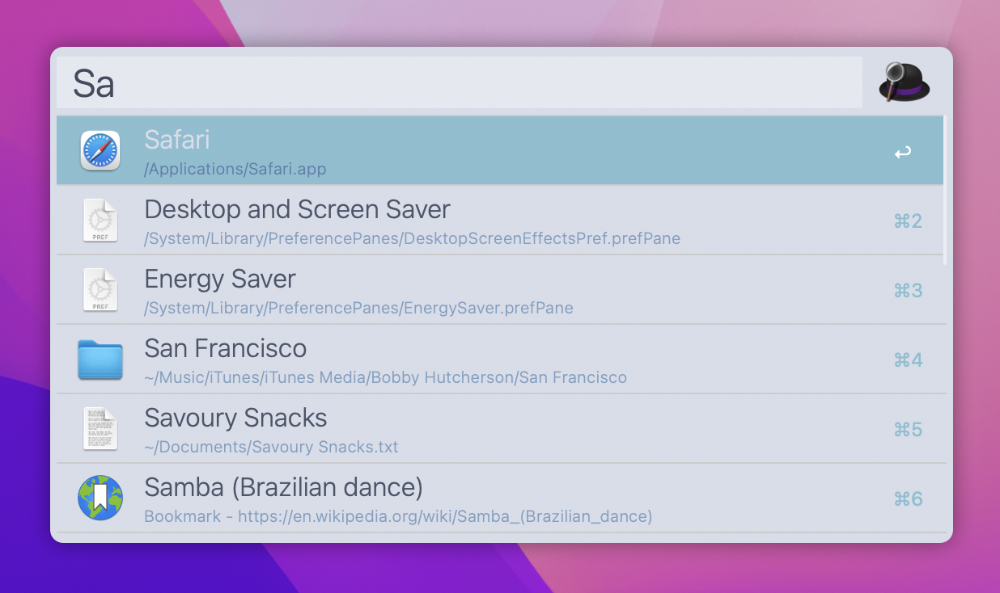

# alfred-nord-light

A light version of the [Alfred](https://www.alfredapp.com) Nord theme from [Artic Studio](https://github.com/arcticicestudio/nord)

## Screenshot

## Installation

- via Alfred Galery: just visit [this](https://www.alfredapp.com/extras/theme/GTs6SkwSdj/) page and tab "Open theme in Alfred"
- manually: download `Nord Light.alfredappearance` to your Mac and double click to install in Alfred.

## License

_You need the [Powerpack](https://www.alfredapp.com/powerpack/) for custom themes._
